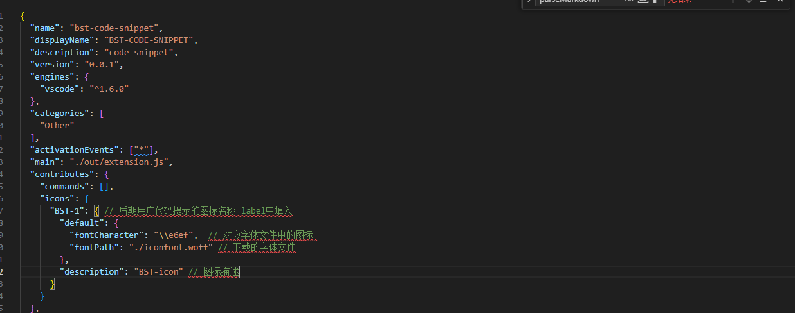
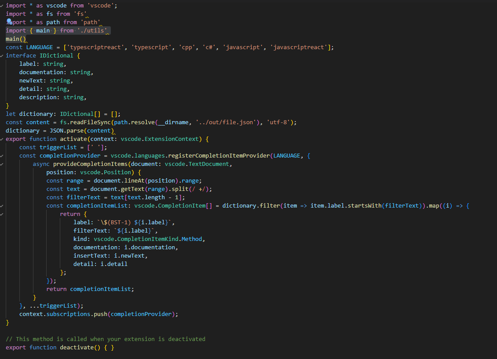
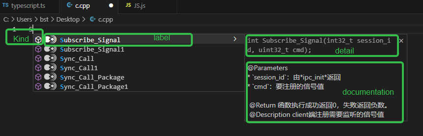
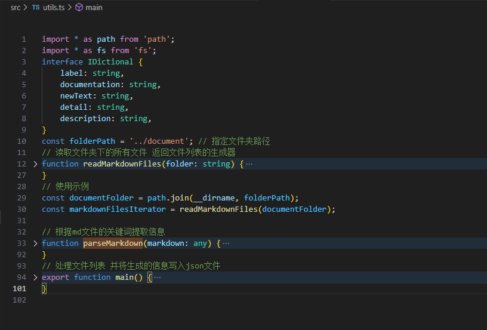
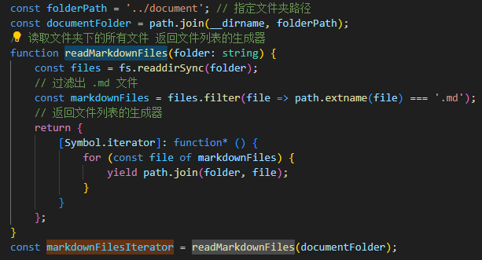
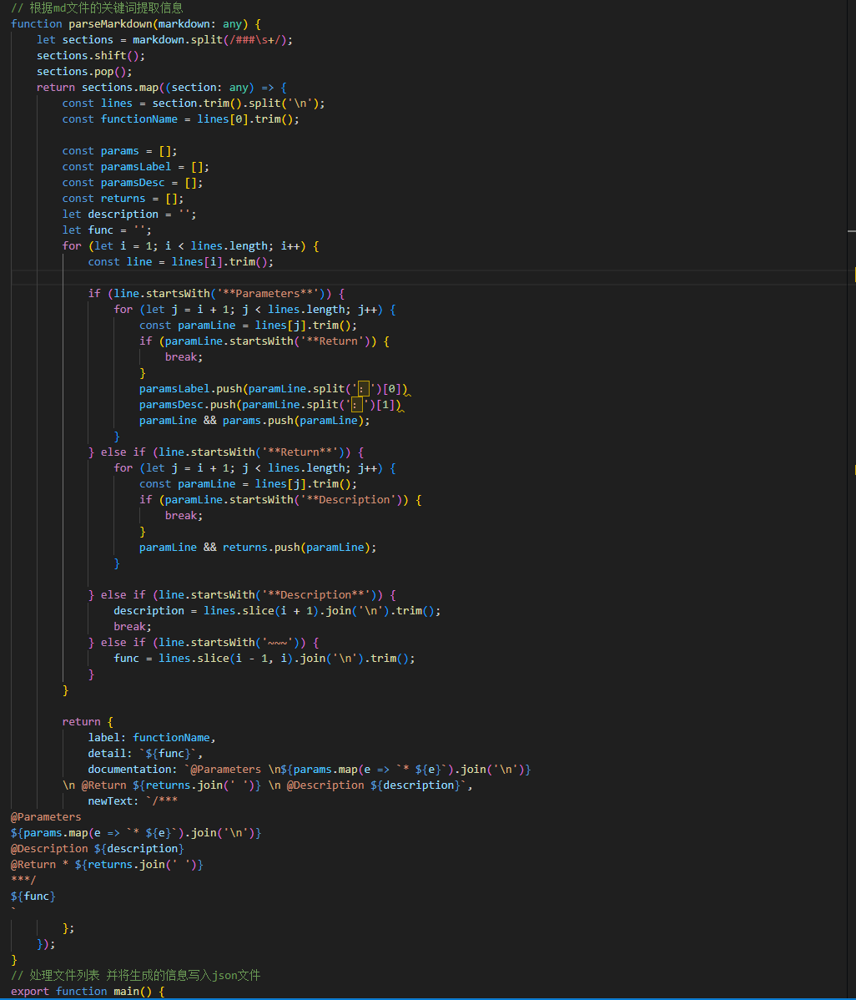
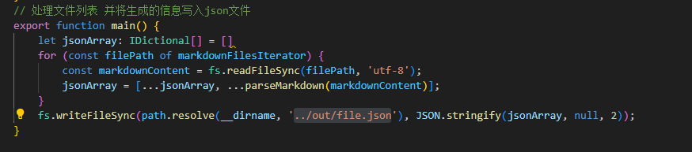
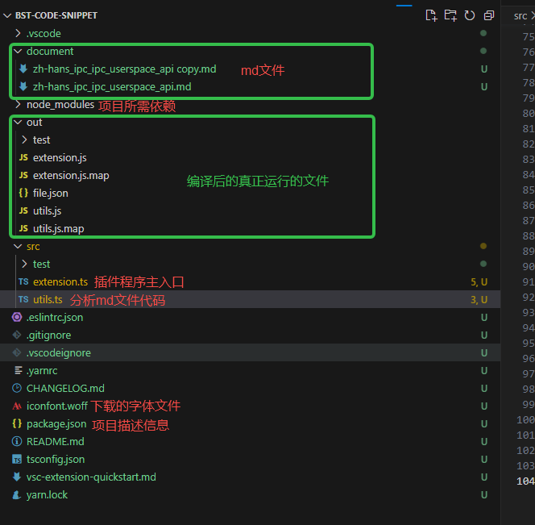

---
 title: vscode 代码提示插件开发
 date: 2023/11/27
 tags: 
 - vscode
---
## 首先用官方脚手架搭建初始项目
1. `npm install -g yo generator-code`
2. `yo code`

## 代码
### package.json

### extension.ts

* api:vscode.languages.registerCompletionItemProvider
    1.LANGUAGE 需要代码提示的文件类型
    2.provideCompletionItems 代码提示提供者
* const range = document.lineAt(position).range; 获取当前光标所在文本行
* const text = document.getText(range).split(/ +/); 将当前光标所在文本以一个或多个空格分割
* const filterText = text[text.length - 1]; 获取到最后一个空格后的文案用于筛选代码提示
* const content = fs.readFileSync(path.resolve(__dirname, '../out/file.json'), 'utf-8'); 获取解析后的md文件
* label: \$(BST-1) ${i.label} BST-1 则是对应package.json中的icon字段
* insertText则是回车之后填入的内容 
* filterText 用于筛选用户的输入字符

> 更多字段详细请查看[【官方文档】 ](https://security.feishu.cn/link/safety?target=https%3A%2F%2Fcode.visualstudio.com%2Fapi%2Freferences%2Fvscode-api%23CompletionItem&scene=ccm&logParams=%7B%22location%22%3A%22ccm_docs%22%7D&lang=zh-CN)

### utils.ts

utils.ts预览

* readMarkdownFiles 读取document下的md文件

> 其中 返回的文件列表生成器对象的好处在于它可以提供一种按需生成值的方式，这对于处理大量数据或者需要动态生成数据的场景很有用
* parseMarkdown 根据md文件的规律分割 Parameters Return  Description并放入数组

### main 
* 将document下的md文件分析结果存入out/file.json文件

### 项目结构

