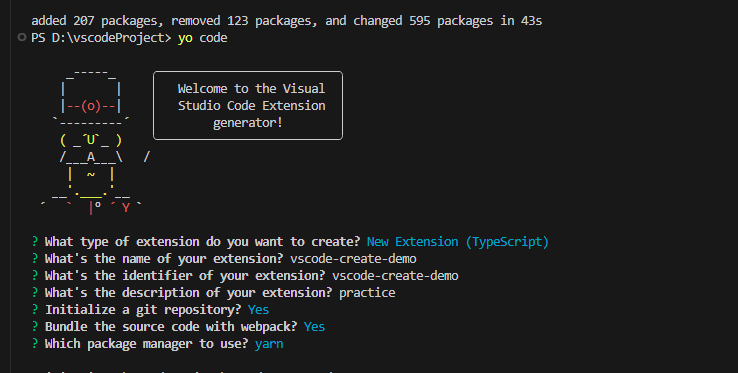
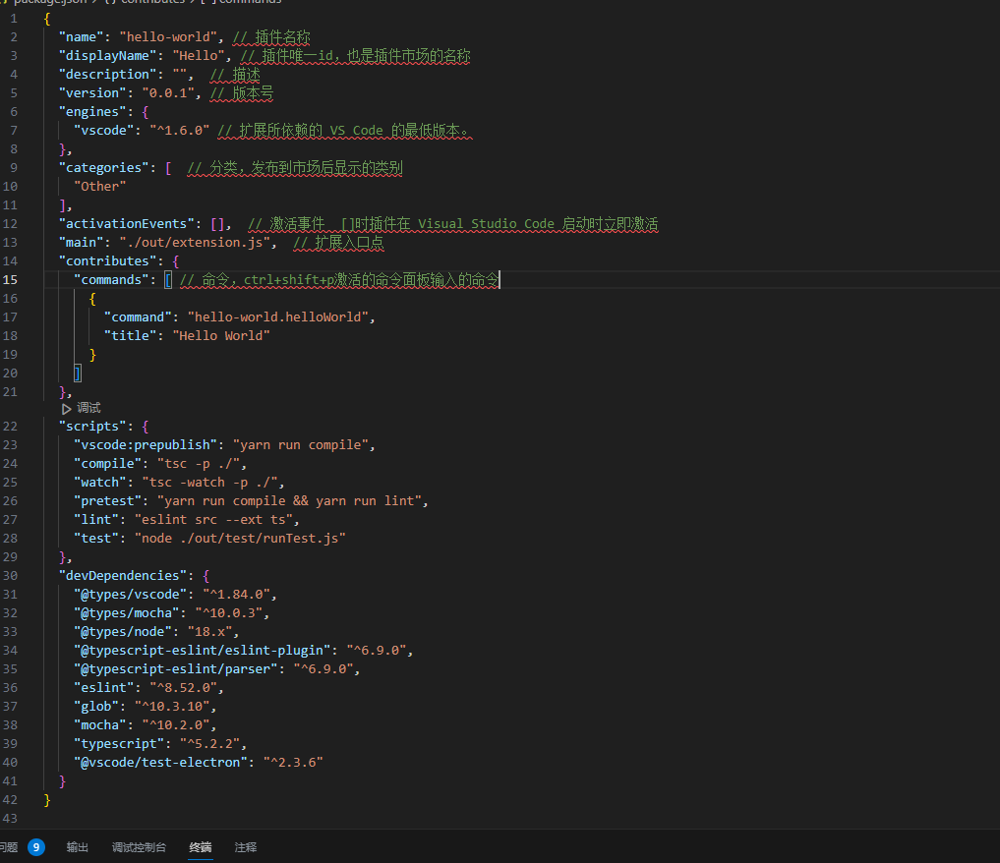

---
 title: Vscode插件创建
 date: 2023/11/23
 tags: 
 - vscode
---

### 安装脚手架及yo代码生成器  
`npm install -g yo generator-code`
* 执行 `yo code` 搭建项目

> 当遇到 Current yeoman-environment is not compatible with current generator, min required: 3.18.4 current version: 3.13.0. Some features may be missing, try updating reinstalling 'yo'. 时, 则在运行一次npm i yo -g  

> 不需要webpack创建

###  package.json配置
> 及时查看vscode版本号  

* 添加命令打开vue.js项目 react项目同理。找到pack
